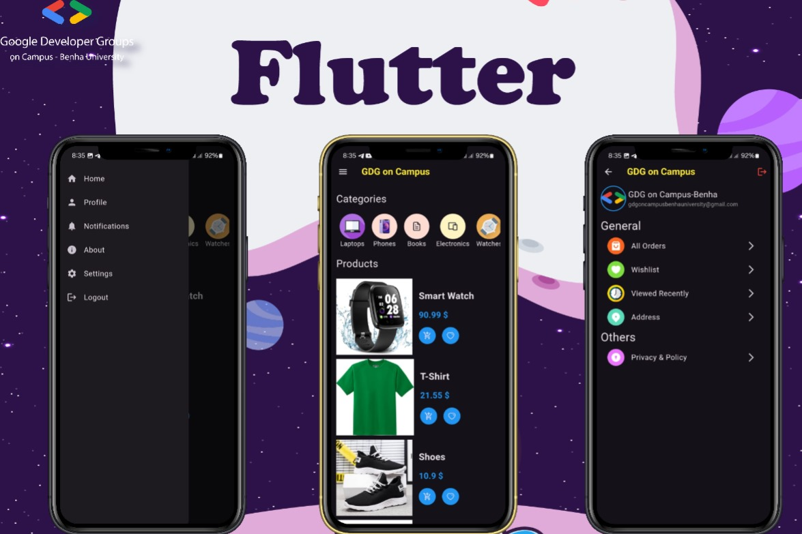

# GDG Competition Project

## Overview
This project was developed as part of the Google Developer Groups (GDG) On Campus competition at Benha University. It aims to provide an innovative solution for [briefly describe the project's purpose and objectives].

## Features
- **Interactive UI**: User-friendly design for an enhanced experience.

## Project Screen


## Prerequisites
Before running this project, ensure you have the following installed:
- Flutter SDK
- Dart
- Android Studio / Xcode

## Installation & Setup
Follow these steps to set up and run the project:

1. Clone the repository:
   ```bash
   git clone https://github.com/ahmedalaayq/gdg_competition_project.git
   ```
2. Navigate to the project directory:
   ```bash
   cd gdg_competition_project
   ```
3. Install dependencies:
   ```bash
   flutter pub get
   ```
4. Run the project:
   ```bash
   flutter run
   ```

## Usage
- Navigate through the app using the intuitive UI.

## Contribution Guidelines
We welcome contributions! To contribute, please follow these steps:

1. Fork the repository.
2. Create a new feature branch:
   ```bash
   git checkout -b feature/your-feature-name
   ```
3. Commit your changes:
   ```bash
   git commit -m "Add feature: Your feature name"
   ```
4. Push to the branch:
   ```bash
   git push origin feature/your-feature-name
   ```
5. Submit a pull request.

## Credits
- **Ahmed Emad** - Mobile App Developer
- **Google Developer Groups - On Campus, Benha University** - Core-Team

## License
This project is licensed under the GDG On Campus - Benha University License.

## Acknowledgments
Special thanks to Google Developer Groups and all contributors who supported this project.

